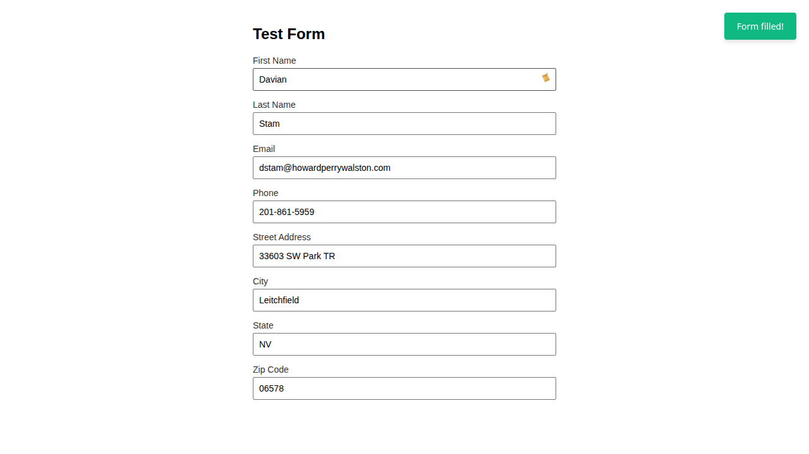
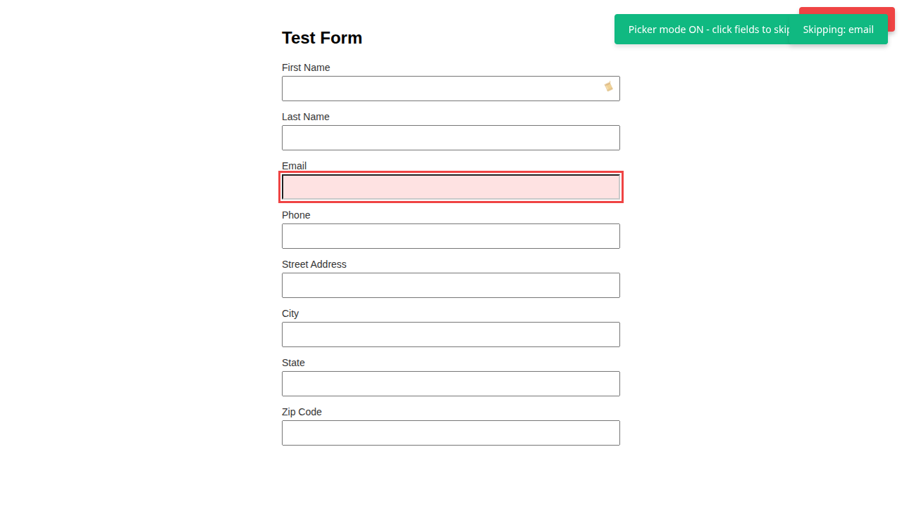

# Actually Useful Form Filler Chrome Extension

Intelligently fill web forms with realistic test data. Click the paint can icon next to any form field to auto-fill an entire form.

## Screenshot



Marking a field to skip via picker mode (click "Pick Fields to Skip" in the popup, then click a field to block it from future auto-fills):



## Files Created

### Core Extension Files
- **manifest.json** - Extension configuration (permissions, scripts, icons)
- **background.js** - Service worker for extension initialization
- **content-script.js** - Injects into web pages, sets up form filling and paint can injection
- **popup.html/popup.js** - Quick access popup with quick toggles
- **settings.html/settings.js** - Full settings page with all options

### Library Files (`lib/`)
- **testFormData.json** - 80+ test data cases (names, addresses, emails, etc.)
- **testFormData.js** - Generator class that reads JSON and generates values
- **validators.js** - Validation and generation logic for zipcodes, phones, emails
- **formFiller.js** - Main form detection and filling logic
- **paintCanInjector.js** - Paint can icon injection next to first text field

### Icons (`icons/`)
- Placeholder for extension icons (16x16, 48x48, 128x128)

## Features

### Auto-Detection
Intelligently detects form field types based on:
1. `dv` attribute (explicit, e.g., `dv="zipcode"`)
2. Smart pattern matching on field name/id/aria-label
3. Fallback logic for unknown fields

### Smart Data Generation
- **Names**: First names, last names with proper formatting
- **Email**: Three intelligent modes:
  - With employer: `{initial}{lastname}@{company}.com`
  - Without employer: `{initial}{lastname}@{random-company}.com`
  - No name data: `{random-initial}{random-lastname}@{random-company}.com`
- **Phone**: 
  - Standard: Random format
  - Plausible: Valid FCC area codes (200-899 except 555), exchanges (200-999), subscribers (0001-9999)
- **Address**: Street address, city, state, ZIP
- **ZIP Codes**: 
  - Valid: No leading 00/97/98/99, no sequential, no all-same-digit
  - Optional: Reconcile with zippopotam.us API to match real city/state
- **Other**: Companies, occupations, salaries, dates, etc.

### Settings

**String Safety**
- Remove vowels, Q, K from random character generation (prevents accidental profanity)

**Phone Numbers**
- Generate only valid FCC-compliant phone numbers

**Location Reconciliation**
- Query zippopotam.us API for matching city/state/ZIP
- User-configurable: 3, 5, or 10 API attempts
- Fallback: Leave blank or use random data

**Paint Can Icon**
- Click icon next to first text field to auto-fill form
- Always visible when enabled (default)

## How to Use

### As User
1. Look for the paint can icon next to the first text field on any form
2. Click the icon to auto-fill all visible form fields with test data
3. Form reactivity: change/input/blur events triggered for validation

### As Developer
Add explicit `dv` attribute to form fields for precise control:
```html
<input type="text" dv="zipcode" name="postal_code">
<input type="email" dv="email" name="user_email">
<select dv="state" name="state_code">...</select>
```

## The `dv` Attribute

The `dv` attribute tells the filler exactly what kind of data to put in a field, overriding both smart pattern matching and the type fallback. It's checked first, before anything else (`_detectDataType` in `lib/formFiller.js`) — use it whenever a field's `name`/`id`/`aria-label`/`placeholder` don't give the pattern matcher enough to go on, or when it guesses wrong.

```html
<input type="text" dv="zipcode" name="postal_code">
```

Supported `dv` values:

| Value | Fills with |
|---|---|
| `first` | First name |
| `last` | Last name |
| `email` | Intelligently generated email (uses first/last/company already filled on the form) |
| `phone` | Phone number (respects the "plausible phone" setting) |
| `zipcode` | ZIP code (respects reconciliation settings) |
| `city` | City |
| `state` | State |
| `street` | Street address |
| `apartment` | Apartment/suite number (only filled ~20% of the time) |
| `company` | Company name |
| `occupation` | Job title |
| `salary` | Annual salary |
| `dob` | Date of birth |

Checkboxes and radios are ignored by default (see [Notes](#notes)) — add a `dv` attribute to one to have it filled anyway.

## Settings Page

Open via the extension's popup or `chrome://extensions` to configure:

| Group | Option | What it does |
|---|---|---|
| 🔒 String Safety | Only safe strings | Strips vowels, Q, and K from randomly generated characters, to avoid accidentally generating profanity |
| 📞 Phone Numbers | Only plausible phone numbers | Generates numbers with valid FCC area codes/exchanges instead of fully random digits |
| 🗺️ Location Data | Reconcile city/state/ZIP | Looks up a real matching city/state/ZIP via the zippopotam.us API instead of generating an unverified one |
| 🗺️ Location Data | API attempts (shown when reconciliation is on) | How many ZIP codes to try (3, 5, or 10) before giving up |
| 🗺️ Location Data | If API fails (shown when reconciliation is on) | Leave the field blank, or fall back to random unverified data |
| 🎨 Paint Can Trigger | Enable paint can icon | Toggles whether the auto-fill icon is injected next to the first text field on a form (on by default) |
| 🚫 Fields to Skip | (list, not a toggle) | Fields marked via "Pick Fields to Skip" in the popup; each is individually removable, plus a "Clear All Skip Fields" button |

**Save Settings** and **Reset to Defaults** buttons apply/discard changes across the whole page.

## Technical Architecture

### Content Script Flow
1. Page loads → Initialize TestFormDataGenerator
2. Load user settings from chrome.storage.sync
3. Setup PaintCanInjector next to first visible text field
4. When user clicks paint can icon:
   - Scan form fields → Detect data types → Generate values
   - Fill fields → Dispatch change/input/blur events

### Form Filling Logic
1. Find all visible form fields
2. For each field:
   - Check `dv` attribute
   - Try smart detection (name/id/aria patterns)
   - Apply fallback (random company for text, parse options for selects)
3. Generate appropriate test data:
   - Apply settings (safe strings, phone validation)
   - Handle reconciliation for zipcodes
   - Use intelligent templates for emails
4. Fill fields and trigger events

### Validation Rules

**Zipcodes**
- Cannot start with 00, 97, 98, 99
- Cannot be sequential (12345, 54321, etc.)
- Cannot be all same digit (11111, 22222, etc.)

**Phone Numbers (Plausible Mode)**
- NPA (Area Code): 200-899 inclusive, except 555
- NXX (Exchange): 200-999 inclusive
- Subscriber: 0001-9999 inclusive, except 0000 and 1111

## Installation

1. Copy entire `chrome-extension/` directory
2. In Chrome: Settings → Extensions → Developer mode (toggle on)
3. Click "Load unpacked" → Select the directory
4. Icon appears in extension menu

## Settings Storage

Settings saved to `chrome.storage.sync`:
- `safeStrings` (boolean)
- `plausiblePhone` (boolean)
- `reconcile` (boolean)
- `reconcileAttempts` (number: 3, 5, or 10)
- `reconcileFallback` (string: "blank" or "random")

## Notes

- Checkboxes and radios ignored unless they have `dv` attribute
- Unknown dropdowns: randomly select from available options
- All visible fields filled (hidden fields skipped)
- Form events dispatched: input, change, blur
- Email generation prefers data in order: employer > company > random
- Zipcode reconciliation requires internet access (zippopotam.us)

## License

See [LICENSE](LICENSE). Free to use, copy, modify, and distribute for non-commercial purposes; commercial use requires permission. Provided with no warranty.
